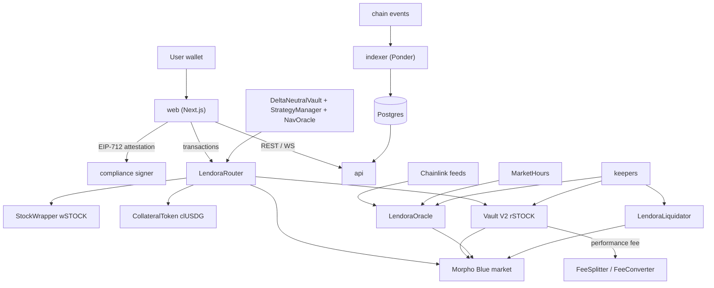

# Lendora

Stock lending on Robinhood Chain, built on unmodified Morpho Blue and Morpho Vault V2.

[](https://github.com/SamyaDeb/Lendora/actions/workflows/ci.yml)


## Overview

**Problem.** Robinhood Chain has tokenized US stocks and ETFs (Stock Tokens), but no way to borrow the stocks
themselves. Holders earn nothing on them, traders cannot short or hedge onchain, and Stock Token price feeds freeze
while US markets are closed, which makes weekend lending against a stale price unsafe.

**Solution.** Lendora lists one Morpho Blue market per stock in which the Stock Token is the loan asset. Lenders deposit
stocks into a Morpho Vault V2 and earn the interest borrowers pay. Borrowers post USDG and borrow the stock to short,
hedge or arbitrage. A market-hours-aware oracle adds a volatility-scaled buffer before and during feed closures and
earnings windows, so positions opened on Friday are sized for Monday's gap. A router bundles each user flow into
one transaction and gates new positions behind compliance attestations and risk caps.

**Why it matters.** Stock lending is the market plumbing that pays holders, enables shorting and keeps prices honest.
Because every borrow is onchain, Lendora also publishes live per-stock short interest (supply, borrowed, utilization,
rate) through an onchain lens and a public API.

Background: [litepaper](docs/LITEPAPER.md) and the [PRD](docs/prd/README.md).

## Key features

- **Stock-loan markets.** Morpho Blue markets with loan `wSTOCK` (a fixed-balance `StockWrapper` of the Stock Token),
  collateral `clUSDG`, `AdaptiveCurveIrm` and 77% LLTV.
- **Lender receipts.** One Morpho Vault V2 per stock (`rSTOCK`), created from the official factory and allocated
  between idle and the market by a keeper under a 90% utilization cap.
- **Closure-aware oracle.** `LendoraOracle` uses Chainlink stock/USD and USDG/USD feeds, `MarketHours` feed sessions
  and event windows, a buffer `b = clamp(z·σ·sqrt(closure/1y), bMin, bMax)`, sanity bands, and a guard that blocks
  new entries without ever reverting the price.
- **One-transaction flows.** `LendoraRouter` (UUPS) implements `lend`, `withdrawLend`, `borrow`, `openShort`,
  `closeShort`, `repay`, `addCollateral` and `withdrawCollateral`, with `multicall`, `selfPermit` and
  `morphoAuthorizeWithSig`.
- **Gated entries, free exits.** New positions need an EIP-712 compliance attestation, a clear oracle guard, a health
  factor of at least 1.10 at t+24h, and per-address and global caps. Exits never need any of them.
- **Fallback liquidator.** `LendoraLiquidator` liquidates through Morpho's callback, unwrapping `clUSDG`, swapping
  through an allowlisted target and repaying in one call.
- **Fees.** Each vault's 10% performance fee goes to `FeeSplitter` (50% treasury, 50% backstop reserve), and
  `FeeConverter`s swap the shares to USDG.
- **Receipt-collateral markets (G5, optional).** Borrow USDG against `rSTOCK`, priced by `ReceiptCollateralOracle`.
- **USDG Earn (delta-neutral vault).** `DeltaNeutralVault` (ERC-4626) and `StrategyManager` hold long spot, lent
  stock and short perps. NAV comes from EIP-712 reports to `NavOracle`, co-signed for large moves. Redemptions queue
  FIFO. The vault ships with caps at 0.
- **Short-interest data.** `ShortInterestLens` onchain, a Ponder indexer, and a REST + WebSocket API with an OpenAPI
  3.1 spec.
- **Operations.** Keepers for allocation, oracle guard, liquidation, fee conversion, alerts, a read-only monitor with
  paging, DN rebalancing and NAV reporting. Runbooks are in [`docs/runbooks`](docs/runbooks/README.md).

## Architecture



Detailed diagrams, including contract inheritance, access control, sequence diagrams for every user flow, the price
path and the deployment view, are in [docs/architecture.md](docs/architecture.md).

## How it works

1. **Lend.** `router.lend` wraps the Stock Token into `wSTOCK` and deposits it into the stock's Vault V2, and the
   lender receives `rSTOCK` shares. The allocator keeper supplies idle liquidity to the Morpho market up to the
   utilization cap.
2. **Borrow or short.** The web app gets an attestation from the compliance service (geo, sanctions, accepted terms).
   `router.openShort` mints `clUSDG` from the user's USDG, supplies it as collateral, borrows `wSTOCK` on the user's
   behalf, unwraps it and optionally sells it for USDG. The router then checks the health factor at the oracle price
   24 hours ahead.
3. **Weekends and events.** When the stock's Chainlink session is about to close, or an earnings window is near, the
   oracle ramps in a buffer that lowers the collateral price. Positions therefore need more collateral before a gap,
   not after it.
4. **Exit or liquidation.** `closeShort` buys back, repays, withdraws and unwraps in one transaction. Positions below
   Morpho's LLTV can be liquidated by anyone, and `LendoraLiquidator` is the protocol's fallback.

| Parameter | Value | Source |
|---|---|---|
| LLTV (stock-loan market) | 77% | `LendoraDeploy.LLTV` |
| Min health factor to open | 1.10 at `t + 24h` | `LendoraRouter.HF_MIN_OPEN`, `HORIZON` |
| Utilization cap (`U_MAX`) | 90% | `packages/sdk/src/params.ts` |
| Buffer `b_full` | `clamp(z·σ·sqrt(closureSeconds / 8760h), bMin, bMax)`, `z = 2.5`, `bMin = 1%`, `bMax = 20%` | `OracleMath.fullBuffer`, `LendoraDeploy._oracleParams` |
| Buffer ramp-in | 4h before a closure or event | `rampIn` |
| Feed sanity band | 0.5x to 2x of the last good answer | `bandLowWad`, `bandHighWad` |
| Stock-loan price | `valuePerToken · usdgAnswer · 10^scale / (stockAnswer · (1 + b))` | `OracleMath.stockLoanPrice` |
| Receipt price | `assetsPerShare · stockAnswer · (1 − b) · 10^scale / usdgAnswer` | `OracleMath.receiptPrice` |
| Health factor | `collateral · price / 1e36 · LLTV / borrowed` | `OracleMath.healthFactor` |
| Vault performance fee | 10%, split 50% treasury, 50% backstop | `PERFORMANCE_FEE_WAD`, `FeeSplitter` |
| Mainnet timelock | 48h (24h on testnet) | `MainnetConfig`, `docs/prd/02-architecture.md` |
| Mainnet launch caps | 25% of the D8 targets; global `clUSDG` cap $4M | `MainnetConfig.LAUNCH_CAP_BPS` |
| NAV second signer | required for a move above 1% of NAV | `NavOracle.SECOND_SIGNER_BPS` |

`packages/sdk/src/math/oracle.ts` mirrors the Solidity math operation for operation. Both implementations are
checked against the same test vectors.

## Tech stack

| Layer | Technology |
|---|---|
| Contracts | Solidity 0.8.26 (cancun), Foundry, OpenZeppelin 5.4, Morpho Blue v1.0.0, Morpho Vault V2 (`2025-12-04`) |
| Shared library | TypeScript, viem (`packages/sdk`: addresses, ABIs, math, calendar, timelock calldata) |
| Indexer | Ponder 0.17, Postgres |
| API | Hono + `@hono/zod-openapi`, WebSocket, Postgres, Redis |
| Compliance | Hono service, EIP-712 signer, Chainalysis or TRM sanctions adapters |
| Keepers | TypeScript + viem, Hono health endpoints |
| Web | Next.js 16, React 19, wagmi 3, TanStack Query; Vitest, Playwright, Lighthouse |
| Simulation | Python (`sim/`) |
| Tooling | pnpm 10 workspaces, Node 22, ESLint, GitHub Actions, Docker, Railway config-as-code |

## Repository structure

```
.
├── contracts/            Foundry project
│   ├── src/              LendoraRouter, StockWrapper, CollateralToken, MarketHours, LendoraLiquidator,
│   │                     ShortInterestLens, oracles/, fees/, vault/, adapters/, interfaces/, libraries/
│   ├── script/           DeployLocal, DeployTestnet*, DeployFork, DeployMainnet, VerifyRoles, LendoraDeploy
│   ├── test/             unit, fuzz, invariant and fork tests; mocks/
│   ├── testnet/          LendoraFaucet (testnet only)
│   └── lib/              git submodules (never modified)
├── packages/
│   ├── sdk/              @lendora/sdk: addresses.json, ABIs, math, calendar, API client
│   ├── devnet/           local chain driver, seed week, smoke flows, fork and live drills
│   └── launch/           mainnet launcher (scripts/mainnet-launch.sh)
├── keepers/              allocator, guard, liquidator, feeConverter, alerts, monitor,
│                         dnRebalancer, navReporter, feedMirror, venueMirror
├── indexer/              Ponder indexer (short interest, fees, receipt markets, DN vault)
├── api/                  public REST + WebSocket API, openapi.json
├── compliance/           attestation signer, geo, sanctions and terms checks
├── web/                  Next.js app (markets, lend, short, portfolio, vault, short interest)
├── sim/                  Python parameter and vault simulations
├── infra/                Dockerfiles, railway/*.json, mainnet.env.example
├── scripts/              dev.sh, dev-testnet.sh, mainnet-launch.sh
├── docs/                 architecture, litepaper, PRD, runbooks, audit package, owner actions
├── docker-compose.yml    local Postgres + Redis
└── .github/workflows/    ci.yml, fork-tests.yml
```

## Getting started

### Prerequisites

- Node.js >= 22 and pnpm 10 (`packageManager: pnpm@10.19.0`)
- Foundry (forge, anvil, cast). CI and the anvil state fixture pin v1.5.1.
- For the local stack: Docker, or local `postgres` and `redis-server` binaries
- Python 3 with a venv in `sim/.venv`, only for the simulations

### Install

```sh
git clone https://github.com/SamyaDeb/Lendora.git && cd Lendora
git submodule update --init contracts/lib/forge-std contracts/lib/openzeppelin-contracts \
  contracts/lib/morpho-blue contracts/lib/metamorpho-v1.1 contracts/lib/vault-v2
git -C contracts/lib/metamorpho-v1.1 submodule update --init lib/openzeppelin-contracts lib/morpho-blue
git -C contracts/lib/vault-v2 submodule update --init lib/morpho-blue lib/morpho-blue-irm
git -C contracts/lib/vault-v2/lib/morpho-blue-irm submodule update --init lib/morpho-blue
pnpm install
```

### Environment

Every package has its own template. Copy it to `.env` and fill it in. `.env` files are git-ignored.

| File | Used by |
|---|---|
| `.env.example` | Phase 0 fork work: `ROBINHOOD_RPC_URL` (archive), `ROBINHOOD_TESTNET_RPC_URL`, explorer key |
| `web/.env.example` | `NEXT_PUBLIC_CHAIN_ID`, `NEXT_PUBLIC_RPC_URL`, `NEXT_PUBLIC_API_URL`, `COMPLIANCE_URL`, `PROXY_SECRET`, `GEO_PLATFORM` |
| `api/.env.example`, `indexer/.env.example`, `compliance/.env.example`, `keepers/.env.example` | services |
| `infra/mainnet.env.example` | mainnet launcher (roles, keys, `LENDORA_*` addresses) |

The local stack (`scripts/dev.sh`) needs no `.env`. It generates a compliance key into `.dev/` on first run.

### Build and test

```sh
cd contracts && forge fmt --check && forge build && forge test   # fork suites skip without an RPC
cd .. && pnpm -r typecheck && pnpm -r lint && pnpm -r test       # keepers/devnet tests need anvil on PATH
```

Fork tests against Robinhood Chain (needs an archive RPC in `ROBINHOOD_RPC_URL`):

```sh
cd contracts && forge test --match-path 'test/fork/**'
```

Regenerate derived files after a contract or API change (CI checks that they are up to date):

```sh
pnpm --filter @lendora/sdk abis                                     # after forge build
pnpm --filter @lendora/sdk build && pnpm --filter @lendora/api openapi
```

### Run locally

```sh
scripts/dev.sh --seed    # Postgres + Redis, anvil + DeployLocal, compliance signer, indexer, API, web, keepers, seed week
scripts/dev.sh --fixture # load the DeployLocal anvil fixture instead of deploying
docker compose up -d     # infra only: Postgres (:55432) and Redis (:56379)
```

To run the services against Robinhood Chain testnet, use `scripts/dev.sh --network 46630` (`--status`, `--stop`).
See [docs/runbooks/testnet.md](docs/runbooks/testnet.md).

## Deployment

| Network | Chain id | Status |
|---|---|---|
| Local anvil | 31337 | `DeployLocal.s.sol`, fixture in `packages/devnet/fixtures` |
| Robinhood Chain testnet | 46630 | Deployed 2026-09-28 (core) and 2026-09-29 (fees, DN vault) with mock Stock Tokens, feeds and perp venue |
| Robinhood Chain mainnet | 4663 | Not deployed. Launcher built and rehearsed on a fork only |

Core testnet (46630) addresses. The full set, including per-stock wrapper, oracle, vault and market ids, is in
[`packages/sdk/addresses.json`](packages/sdk/addresses.json):

| Contract | Address |
|---|---|
| `LendoraRouter` (proxy) | `0x8233785b189bAEBB54242ABD34ce2069DFA55C0B` |
| `LendoraRouter` (implementation) | `0x05a084D679Eabba4fB6F3448A358B549D693d69E` |
| `CollateralToken` (clUSDG) | `0x55aE95C20A051870E370AD83127Be026164c5d4C` |
| `MarketHours` | `0x2a9EAbBE25dcB91e77547cD710046Bf065d15a37` |
| `LendoraLiquidator` | `0x484d70a895013B72b60b2B2C614B01F9917cA14c` |
| `ShortInterestLens` | `0x3d99fa5651D78D47974cf4D94aaE9866F85A1896` |
| `TimelockController` | `0x4A302FF565870066F285E022707E64728fb82314` |
| `FeeSplitter` | `0xc9ED94bfe581c8aE4d9C1F115f96537f81f23674` |
| `DeltaNeutralVault` | `0xcDFa4DD7535cFae585BbFe4627D8B0124be43118` |
| `NavOracle` | `0xE189867a9f0ae990e18eEe53F17CC452F3BF8863` |
| `StrategyManager` | `0x2a79c00A3722F99F0B33a0707929Aaa1e440C28c` |
| Morpho Blue (testnet instance) | `0xCff25c2c38c1D8966Fc9A205692B57Bde52A33Bb` |

Deploy steps:

- **Testnet:** `forge script script/DeployTestnet.s.sol`, then `DeployTestnetFees.s.sol` and `DeployTestnetVault.s.sol`
  with `TESTNET_GO=yes`. Exact commands and flags are in [docs/runbooks/testnet.md](docs/runbooks/testnet.md).
- **Mainnet:** only through `pnpm launch:mainnet` (`scripts/mainnet-launch.sh`). It runs the gates, environment and
  Safe checks, a fork rehearsal, a typed-confirmation broadcast of `DeployMainnet.s.sol`, `VerifyRoles.s.sol`, and
  then publishes the addresses. See [docs/runbooks/mainnet-launch.md](docs/runbooks/mainnet-launch.md).
- **Services:** one image (`infra/Dockerfile`, `SERVICE=<name>`) per backend service, plus `infra/web.Dockerfile`, with
  Railway config in `infra/railway/`. Required secrets per service are listed in [infra/README.md](infra/README.md).

## Smart contract reference

| Contract | Purpose | Key functions |
|---|---|---|
| `LendoraRouter` | One-transaction user flows; entry checks (guard, attestation, HF, caps). UUPS, ERC-7201 storage | `lend`, `withdrawLend`, `borrow`, `openShort`, `closeShort`, `repay`, `addCollateral`, `withdrawCollateral`, `listMarket`, `healthFactorAt` |
| `StockWrapper` | Fixed-balance 1:1 ERC-20 wrapper of a Stock Token (`wSTOCK`) | `wrap`, `unwrap`, `backingShortfall` |
| `CollateralToken` | `clUSDG`: gated USDG wrapper, mint only by the router | `mint`, `unwrap`, `setRouter` |
| `LendoraOracleBase` | Shared feed checks, closure/event buffer and guard (abstract) | `price`, `priceAt`, `guardReasons`, `poke`, `trip`, `clear`, `raiseBufferFloor`, `setParams` |
| `LendoraOracle` | Morpho `IOracle` for stock-loan markets (clUSDG / wSTOCK) | inherits `LendoraOracleBase` |
| `ReceiptCollateralOracle` | Morpho `IOracle` for receipt markets (rSTOCK / USDG) | inherits `LendoraOracleBase` |
| `MarketHours` | Chainlink 24/5 feed sessions and per-stock event windows | `replaceSessionsFrom`, `replaceEventsFrom` |
| `LendoraLiquidator` | Fallback liquidator via Morpho's liquidation callback | `liquidate`, `onMorphoLiquidate`, `setSwapTarget` |
| `ShortInterestLens` | Per-stock short interest read from chain | view functions (`IShortInterestLens`) |
| `FeeSplitter` | Splits vault performance-fee shares between recipients | `distribute`, `setRecipients` |
| `FeeConverter` | Converts fee shares to USDG and forwards them | `convert`, `quote`, `forwardUnconverted` |
| `BlocklistHolderAllowlist` | Optional unwrap pre-check against the issuer blocklist | `isAllowed` (`IHolderAllowlist`) |
| `DeltaNeutralVault` | USDG Earn ERC-4626, priced at `NavOracle.nav()`, attested entries, FIFO redemption queue | `deposit(assets, receiver, att)`, `requestRedeem`, `settle`, `claim`, `sendToStrategy`, `accrueFee` |
| `StrategyManager` | Custodian and limit checker of the vault's spot, lent and perp positions | `buySpot`, `sellSpot`, `lend`, `unlend`, `adjustShort`, `depositMargin`, `killSleeve` |
| `NavOracle` | NAV from EIP-712 reports, with a second signer for large moves | `submit`, `nav`, `setSigner`, `setMaxAge` |
| `OracleMath` (library) | Buffer, price and health-factor math, mirrored in the SDK | `fullBuffer`, `windowBuffer`, `stockLoanPrice`, `receiptPrice`, `healthFactor` |
| `LendoraFaucet` (testnet) | Drips mock Stock Tokens and USDG | `claim` |

## Security considerations and known limitations

- **Audit status.** The audit packages are prepared ([docs/audit](docs/audit/README.md), [phase 4](docs/audit/phase4/README.md)),
  but no external audit report is in the repository. There is a threat model, an offchain review and a bug bounty
  draft in `docs/audit/`.
- **Trust model.** A multisig acting through a `TimelockController` (48h on mainnet) owns every Lendora contract and
  vault. The guardian can only reduce risk. The router is upgradeable, and nothing else in `src/` is.
- **Soft gate.** Morpho Blue is permissionless, so a borrower with `clUSDG` already in a market can borrow directly on
  Morpho, bypassing the router's per-address cap. This is bounded by vault caps and detected by the monitor
  (`DIRECT_BORROW`).
- **Issuer and stablecoin risk.** An issuer `adminBurn` can leave `wSTOCK` under-backed (reported by
  `backingShortfall()`), an issuer pause blocks stock-moving exits, and a Paxos freeze of USDG at `clUSDG` blocks
  unwraps.
- **Oracle.** There is no sequencer uptime feed on chain 4663, so the guard keeper's L2 block-gap check is the
  mitigation. A genuine move beyond the 0.5x–2x band blocks new borrows until a timelocked `resetReferences`. A wrong
  event window lets an earnings gap through unbuffered.
- **Delta-neutral vault.** NAV depends on offchain reports: two signers are needed for moves above 1%, and reports
  must be fresh and consistent with onchain trades. The repository contains only a mock perp adapter
  (`MockPerpVenue`), and the vault is deployed with caps at 0.
- **Compliance.** Attestations are signed by an offchain key. Geo checks rely on edge headers protected by
  `PROXY_SECRET`.
- **Names kept from before the rename.** The router's ERC-7201 namespace (`stockline.storage.StocklineRouter`), the
  EIP-712 domain names (`StocklineRouter`, `Stockline NavOracle`) and the deployed token names keep their original
  strings, because changing them would break the deployed contracts or their signatures.

The full list, with the tests that cover each item, is in [docs/audit/README.md §7](docs/audit/README.md#7-known-issues-and-accepted-risks).

## Roadmap

From [docs/prd/11-milestones.md](docs/prd/11-milestones.md) and [open questions](docs/prd/12-open-questions.md):

- [x] Phase 1: lending core contracts, fork-tested
- [x] Phase 2: app, indexer, API, compliance, testnet deployment (46630)
- [ ] Phase 3: two external audits, then guarded mainnet with launch caps (launcher built, never run)
- [ ] Phase 4: delta-neutral vault. Engineering done; the simulation gate reports insufficient data, a production perp
      adapter is not implemented, and caps are 0
- [ ] Phase 5: `BackstopPool` first-loss staking (not yet in code; a backstop reserve multisig receives fees meanwhile)
- [ ] Open owner decisions: sanctions provider (Q5), archive RPC (Q7), mainnet role addresses (Q9), MetaMorpho
      submodule removal (Q13), payouts (Q14), mainnet hosting (Q15)

## Contributing

1. Branch from `main`. Keep contracts, generated ABIs, the OpenAPI spec and the SDK client in sync (see
   [Build and test](#build-and-test)).
2. Before opening a PR, run `forge fmt --check`, `forge build --sizes` (`LendoraRouter` is close to the 24 KiB limit),
   `forge test`, `pnpm -r typecheck`, `pnpm -r lint` and `pnpm -r test`. CI runs the same steps, plus Playwright e2e
   and Lighthouse.
3. Reference the PRD requirement ids (for example `RT-R8`, `OR-R20`) in code comments and test names, as the
   existing code does.
4. Never modify the submodules under `contracts/lib/`.

## License

No license file is included. The Solidity sources are marked `SPDX-License-Identifier: UNLICENSED`, and all rights
are reserved by the authors. The dependencies under `contracts/lib/` keep their own licenses.
