# Lendora architecture

This document describes the system as it is implemented in this repository. Names in the diagrams are the real
contract, function, package and service names. Requirement ids (RT-R1, OR-R20, DN-R5, ...) refer to the PRD in
[`docs/prd/`](prd/README.md), which holds the full specification.

- [1. System context](#1-system-context)
- [2. Smart contract architecture](#2-smart-contract-architecture)
- [3. Core user flows](#3-core-user-flows)
- [4. Data and price flow](#4-data-and-price-flow)
- [5. Deployment and infrastructure](#5-deployment-and-infrastructure)

## 1. System context

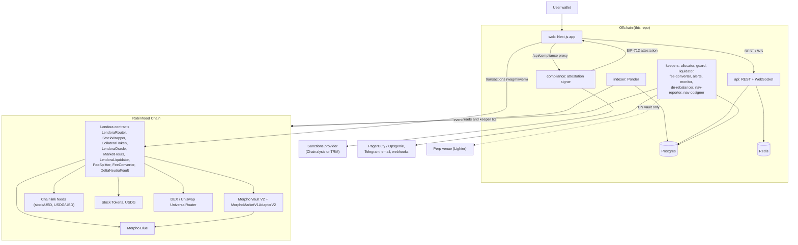

Lendora is a thin layer over unmodified Morpho Blue and Morpho Vault V2. The contracts add a stock wrapper, a gated
collateral token, a market-hours-aware oracle, a router for one-transaction flows, and fee and vault contracts. The
offchain side has three parts. The compliance signer issues the EIP-712 attestation the router requires for new
positions. The Ponder indexer and the API publish market and short-interest data. The keepers run the operational
loops: vault allocation, oracle guard, fallback liquidation, fee conversion, alerts, monitoring, and the
delta-neutral vault's rebalancing and NAV reports.

## 2. Smart contract architecture

### 2.1 Inheritance and interfaces

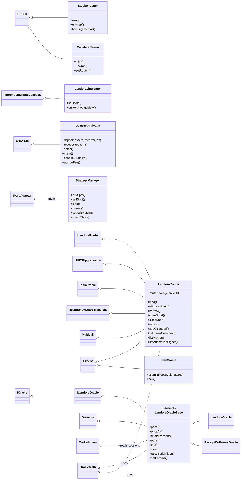

`LendoraRouter` is the only upgradeable contract (UUPS). It keeps its configuration in the ERC-7201 namespace
`stockline.storage.StocklineRouter`. That string predates the rename, and changing it would move the router's
storage. Both Morpho oracles share `LendoraOracleBase` (feed checks, closure/event buffer, guard). `OracleMath` holds
the pure price and health-factor math, which `packages/sdk/src/math/oracle.ts` mirrors operation for operation.
Other than the router, the Lendora contracts are plain `Ownable` or immutable.

### 2.2 Composition per listed stock

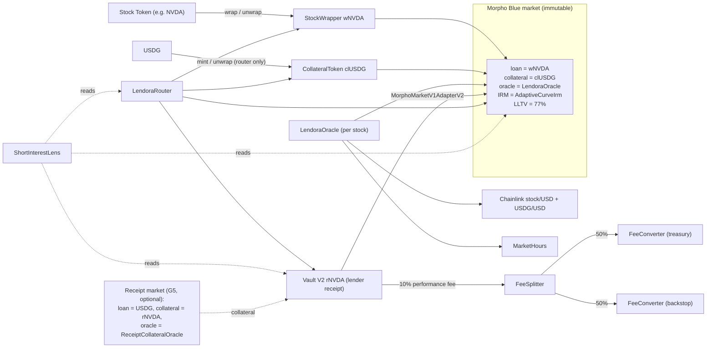

`LendoraDeploy._deployStock` deploys one `StockWrapper`, one `LendoraOracle`, one Morpho market, one Vault V2 from
the official `VaultV2Factory` and one `MorphoMarketV1AdapterV2` for each stock. Lenders hold Vault V2 shares
(`rSTOCK`), and the vault allocates between idle and the Morpho market. Borrowers post `clUSDG`, a USDG wrapper that
only the router can mint, which means every new position has passed the router's checks. Performance fees go through
`FeeSplitter` to two `FeeConverter`s, which swap them to USDG for the treasury and the backstop reserve.

### 2.3 Access control

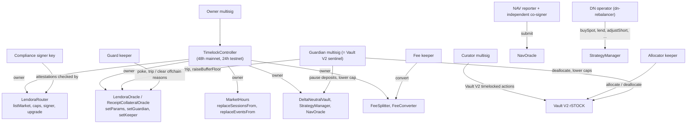

The timelock owns every Lendora contract and each Vault V2 (`VerifyRoles.s.sol` checks the role wiring after a
deploy). The guardian can only reduce risk: trip the oracle guard, raise the buffer floor, deallocate, lower caps,
pause vault deposits. The keeper keys are narrow: the allocator moves liquidity inside a vault, the guard keeper trips
or clears reasons it detects offchain, and the DN operator acts within `StrategyManager` limits (sleeve caps, max
slippage, max lend share). Morpho markets are immutable, so no role can change a live market's LLTV, IRM or oracle.

## 3. Core user flows

### 3.1 Lend a stock

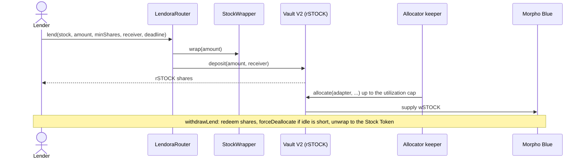

Lending needs no attestation. The router wraps the Stock Token, deposits it into the stock's Vault V2 and sends the
`rSTOCK` shares to the receiver, with `minShares` as the slippage bound. The allocator keeper, not the user
transaction, moves idle liquidity into the Morpho market, keeping utilization under `U_MAX` (90%). `withdrawLend`
calls `forceDeallocate` when the vault's idle balance cannot cover the redemption.

### 3.2 Borrow or open a short

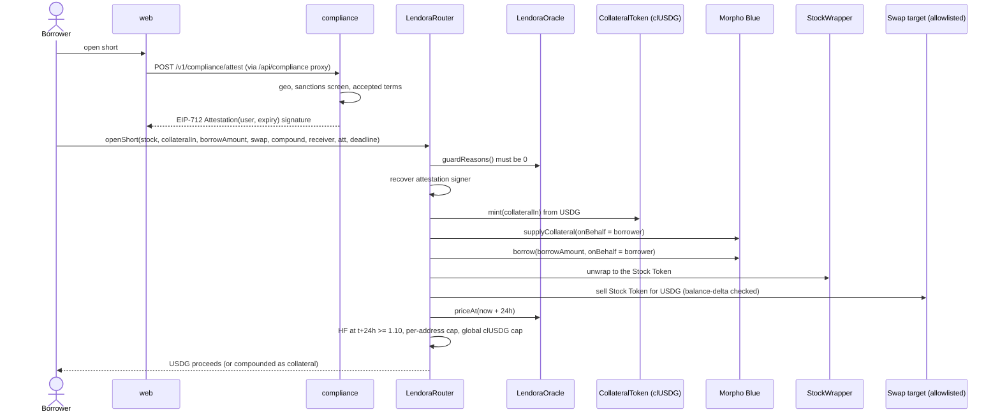

New positions (`borrow`, `openShort`) must pass two checks before any state changes. The oracle guard has to be
clear, and the caller needs a valid attestation from the configured signer (`_openChecks`). After the position is
built, `_positionChecks` requires a health factor of at least 1.10 at the oracle price 24 hours ahead, which already
includes any weekend or event buffer, and checks the per-address and global caps. `borrow` is the same flow without
the swap. The user authorizes the router on Morpho once (`setAuthorization`, or `morphoAuthorizeWithSig` inside a
`multicall`).

### 3.3 Close a short or repay

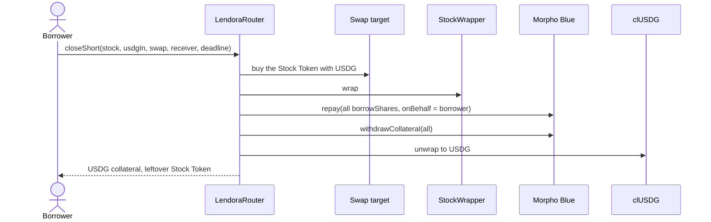

Exits (`closeShort`, `repay`, `withdrawCollateral`, `withdrawLend`) never need an attestation or a guard check, so
users can always leave, including during weekends and when the guard is tripped. `addCollateral` is a rescue top-up.
It also needs no attestation, but it only works for positions that already have debt (`NoDebtPosition`), so new
exposure always goes through the attested entries.

### 3.4 Liquidation

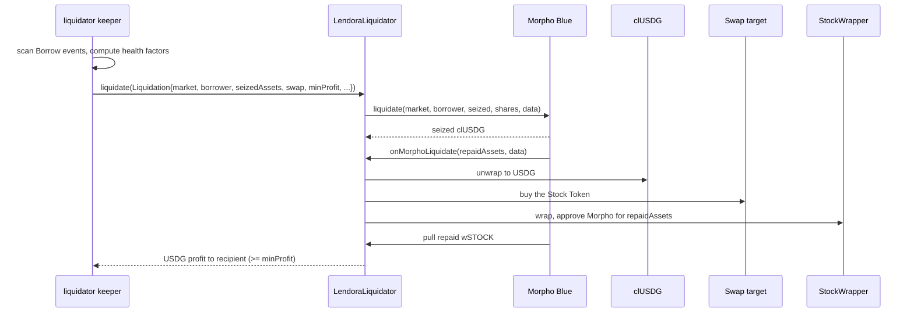

Liquidations are standard Morpho Blue liquidations, open to any liquidator. `LendoraLiquidator` is the protocol's
fallback. Inside Morpho's callback it unwraps the seized `clUSDG`, buys the Stock Token through an allowlisted target,
wraps it and repays. A transient-storage flag (`IN_LIQUIDATION`) makes sure the callback only runs during the
contract's own call. The contract holds nothing after a call.

### 3.5 Delta-neutral vault (USDG Earn)

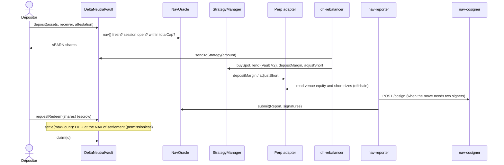

`DeltaNeutralVault` is an ERC-4626 vault over USDG, priced at `NavOracle.nav()`. Deposits require the router's
compliance attestation, a fresh NAV, an open feed session and room under `totalCap`. `StrategyManager` holds the
spot, lent and perp legs and enforces per-sleeve limits. The venue's perp equity cannot be read onchain, so NAV comes
from EIP-712 reports. A report that moves the NAV by more than 1% needs two distinct signers: the nav-reporter plus
an independent co-signer. Exits are instant up to the idle USDG, or go through the `requestRedeem` / `settle` /
`claim` queue. The only `IPerpAdapter` in the repo is `MockPerpVenue`, which the testnet deploy uses.

## 4. Data and price flow

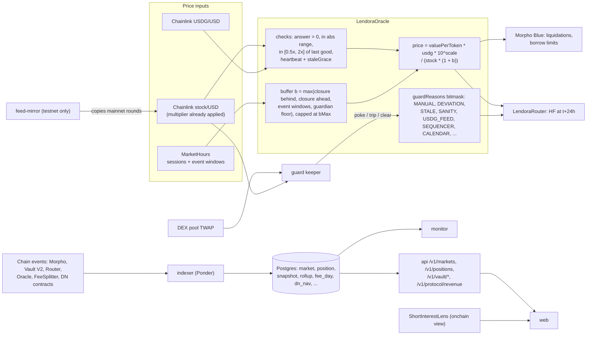

`LendoraOracle` combines the Chainlink stock and USDG feeds with a closure/event buffer. When the stock's feed session
is closed (weekends, holidays, overnight) or an earnings window is near, the buffer lowers the collateral value by up
to `bMax` (20%). It ramps in over `rampIn` (4h) before a closure. A feed failure never makes the price revert: the
oracle falls back to the last good answer and trips the guard, which blocks new entries but leaves exits and
liquidations working. Onchain events flow through the Ponder indexer into Postgres, which serves the public API, the
short-interest dashboard and the monitor. `ShortInterestLens` gives the same per-stock numbers straight from chain.

## 5. Deployment and infrastructure

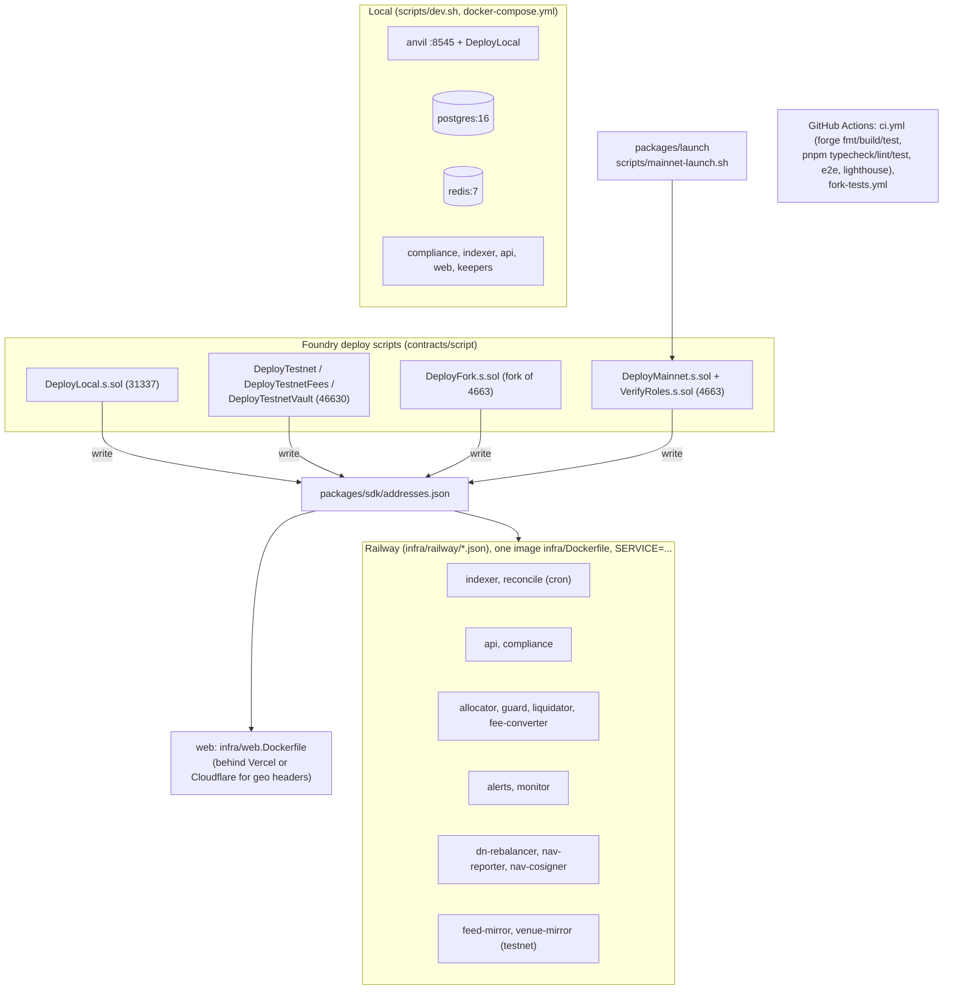

Contracts are deployed with Foundry scripts, which write addresses into `packages/sdk/addresses.json`, the single
source every service reads. Every backend service is built from one image (`infra/Dockerfile`), selected by `SERVICE`,
and has a Railway config-as-code file with a health check. The web app has its own image. Mainnet goes only through
`scripts/mainnet-launch.sh` (`packages/launch`): gates, environment and Safe checks, a fork rehearsal, a
typed-confirmation broadcast, then `VerifyRoles`. According to `infra/README.md`, no hosted services are deployed
yet. The contracts are live on Robinhood Chain testnet (46630). Mainnet has not been deployed.
