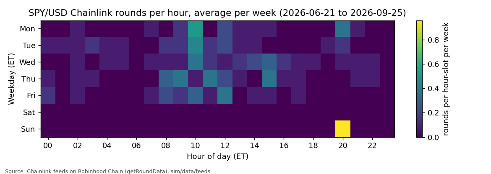
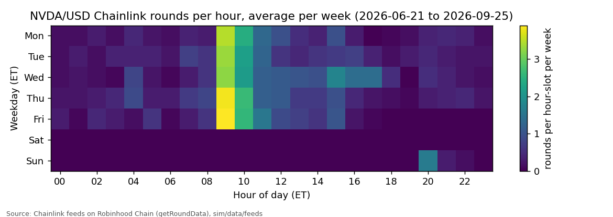
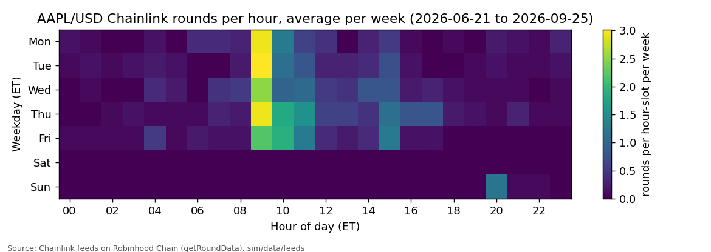
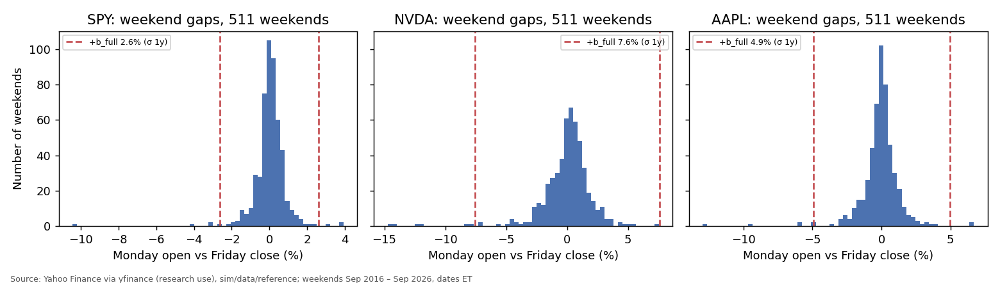

# Phase 0 · WS-C · Weekend and price-gap report

*Generated by `sim/phase0/analyze.py`. Inputs and how to refresh them: `sim/phase0/README.md`. Times are ET (America/New_York) unless marked UTC. Onchain history runs from the feeds' first round (2026-06-21 20:00 ET) to 2026-09-26, so onchain statistics cover about 14 weekends; tails come from 10 years of reference prices.*

## 1. Feed update pattern (24/5 check)

| Stock | Rounds | Median time between rounds | p99 / max gap Mon–Fri 20:00 (h) | Rounds on Saturdays | Weekend freeze: last Friday round → first round after (median, range) |
|---|---|---|---|---|---|
| SPY | 146 | 735 min | 24.0 / 80.8 | 0 | 58.2 h (50.4–80.8 h); last Friday round 07:25–17:36 ET, first round after 20:00–20:00 ET (Sun) |
| NVDA | 1106 | 32 min | 12.7 / 78.2 | 0 | 52.1 h (50.1–78.2 h); last Friday round 11:24–17:53 ET, first round after 20:00–20:01 ET (Sun) |
| AAPL | 671 | 37 min | 18.1 / 76.2 | 0 | 54.4 h (50.4–79.7 h); last Friday round 10:21–17:39 ET, first round after 20:00–20:00 ET (Sun) |

**Reading.** Rounds occur every weekday hour including overnight (20:00–04:00 ET) and stop from Friday evening to Sunday evening: the feeds are 24/5 (OR-R13: yes). The feeds update on 0.5% deviation or a 24 h heartbeat, so a quiet SPY can go many hours without a round even while the market is open. The staleness guard (heartbeat + 10 min) must therefore use the 24 h heartbeat, which makes it a weak detector during the week.

## 2. Onchain weekend and overnight gaps (feed vs feed)

| Stock | Weekends | Friday last → first round after freeze: median / max abs | Friday last → first round ≥ Mon 09:30: median / max abs | Largest move up (Mon 09:30) |
|---|---|---|---|---|
| SPY | 13 | 0.29% / 0.70% | 0.51% / 1.19% | 1.19% |
| NVDA | 13 | 0.82% / 1.18% | 0.37% / 3.45% | 2.00% |
| AAPL | 13 | 0.20% / 0.95% | 0.69% / 2.67% | 1.45% |

**Overnight under 24/5.** The feed keeps publishing through weeknights, so a regular-hours feed's overnight gap does not exist as a step. What remains is (a) the size of a single overnight round-to-round jump and (b) how long the feed can sit without a round at night.

| Stock | Weeknight rounds | Round-to-round jump p99 / max | Hours between night rounds p99 / max | 16:00 → next 09:30 move (the step a regular-hours feed would take): p99 / max abs |
|---|---|---|---|---|
| SPY | 16 | 0.52% / 0.52% | 17.8 / 17.9 | 1.52% / 1.54% |
| NVDA | 130 | 0.61% / 0.63% | 12.9 / 13.7 | 4.57% / 6.19% |
| AAPL | 42 | 0.65% / 0.68% | 15.2 / 16.2 | 5.22% / 8.11% |

**Reading.** Overnight the 24/5 feed moves in small steps (the table's jump column), not one gap at the open, so the overnight buffer can be small or zero (`overnightMode` on). The weekend freeze remains: about 48 h from Friday 20:00 to Sunday 20:00 ET.

## 3. Realized volatility and the buffer table (04-oracle.md §3 recomputed)

σ_annual from daily log returns of adjusted closes (dividends included, like the token's total-return price).

| Stock | σ 1y | σ 3y | σ 5y | σ 10y | PRD placeholder |
|---|---|---|---|---|---|
| SPY | 13.0% | 15.2% | 17.2% | 18.0% | 18% |
| NVDA | 37.6% | 46.7% | 51.6% | 49.8% | 50% |
| AAPL | 24.6% | 26.7% | 28.0% | 29.1% | 28% |

b_full = clamp(z·σ·√(h/8760), 1%, 20%), z = 2.33.

| Stock | σ used | Weekend 65.5 h (PRD) | Weekend 48 h (24/5 freeze) | Overnight 17.5 h (PRD) |
|---|---|---|---|---|
| SPY | 1y 13.0% | 2.6% | 2.2% | 1.4% |
| SPY | 5y 17.2% | 3.5% | 3.0% | 1.8% |
| NVDA | 1y 37.6% | 7.6% | 6.5% | 3.9% |
| NVDA | 5y 51.6% | 10.4% | 8.9% | 5.4% |
| AAPL | 1y 24.6% | 4.9% | 4.2% | 2.6% |
| AAPL | 5y 28.0% | 5.6% | 4.8% | 2.9% |

## 4. Buffer adequacy over 10 years of weekends

Gap = Monday (or post-holiday) open vs the prior close, adjusted for splits and dividends. σ is the trailing 252-day σ known on that Friday (as a weekly-updated oracle param would be). Closure hours are calendar hours between the sessions (65.5 h for a normal weekend). Under a 24/5 feed the real frozen window is shorter (~48 h) and Friday evening and Sunday night moves are tracked, so these gaps overstate what the oracle sees; they are a conservative upper bound.

| Stock | Weekends | Median abs gap | p99 abs gap | Max up | Max down | Share with abs gap > b_full (z 2.33) | Share with gap **up** > b_full | z for 99% (abs) | z for 99.9% (abs) | z for 99.9% (up only) |
|---|---|---|---|---|---|---|---|---|---|---|
| SPY | 511 | 0.32% | 3.09% | 3.94% (2020-11-09) | -10.45% (2020-03-16) | 0.59% | 0.00% | 1.74 | 4.24 | 1.68 |
| NVDA | 511 | 0.92% | 7.80% | 7.53% (2020-09-14) | -14.74% (2019-01-28) | 0.98% | 0.00% | 1.54 | 3.26 | 1.43 |
| AAPL | 511 | 0.51% | 5.72% | 6.71% (2025-04-14) | -12.96% (2020-03-16) | 0.98% | 0.20% | 2.23 | 4.41 | 2.35 |

For a stock-loan market only **upward** gaps hurt lenders (the borrowed stock gets more expensive). Beyond the buffer, the position still has the LLTV margin before bad debt; section 7 combines both.

## 5. Weekend premium: DEX price vs frozen feed

DEX price = last Uniswap v3 swap in a ~1-minute window at the top of each hour (USDG and WETH pools; WETH converted with Chainlink ETH/USD). Premium = DEX / feed in force − 1. "Closed" = Friday 20:00 → Sunday 20:00 ET with a feed older than 1 h.

| Stock | Pool(s) | Hours sampled (closed / open) | Closed: p50 / p90 / p99 / max premium | Closed: min | Open: p50 / p99 abs | Weekends with abs premium > 3% / > 12% |
|---|---|---|---|---|---|---|
| SPY | none yet | – | BLOCKED: DEX samples not fetched | | | |
| NVDA | none yet | – | BLOCKED: DEX samples not fetched | | | |
| AAPL | none yet | – | BLOCKED: DEX samples not fetched | | | |
## 6. DEX depth (USD to move the pool price 2%)

| Snapshot (UTC) | Block | Pool | Push up 2% (buy stock) | Push down 2% (sell stock) |
|---|---|---|---|---|
| 2026-09-26T15:57 | 73207817 | NVDA_USDG_500 | $1,117,068 | $1,431,472 |
| 2026-09-26T15:57 | 73207817 | NVDA_WETH_500 | $140,708 | $112,713 |
| 2026-09-26T15:57 | 73207817 | SPY_WETH_500 | $216,378 | $180,084 |
| 2026-09-26T15:57 | 73207817 | SPY_USDG_500 | $98,317 | $126,243 |
| 2026-09-26T15:57 | 73207817 | AAPL_WETH_500 | $48,564 | $39,128 |
| 2026-09-26T15:57 | 73207817 | AAPL_USDG_500 | $97,186 | $98,564 |

Only weekend snapshots exist. **Weekday comparison: BLOCKED** until `dex_depth.py` runs on a weekday or an archive RPC is available to read `slot0`/ticks at past weekday blocks. v3 pools are passive liquidity, so depth should not change by day unless LPs pull liquidity for weekends; this needs the check.

## 7. Liquidation profitability during weekend premiums

LLTV 77% → LIF 1.07411 (incentive 7.41%). A liquidator repays wSTOCK valued by the oracle at P_feed·(1+b) and seizes USDG worth LIF times that. If they must buy the stock on the DEX at P_feed·(1+premium) with slippage s, the trade pays only if (1+b)·LIF > (1+premium)·(1+s). Break-even premium = (1+b)·LIF/(1+s) − 1.

| Stock | b_full weekend (σ 1y) | Break-even premium, s = 0 / 1% / 2% | Share of closed hours above break-even (s = 1%) | Worst closed-hour premium |
|---|---|---|---|---|
| SPY | 2.6% | 10.2% / 9.1% / 8.1% | BLOCKED (no DEX samples) | – |
| NVDA | 7.6% | 15.6% / 14.4% / 13.3% | BLOCKED (no DEX samples) | – |
| AAPL | 4.9% | 12.7% / 11.6% / 10.5% | BLOCKED (no DEX samples) | – |

**Reading.** With the buffer in force, the oracle already values the stock above the frozen feed by b, so the liquidator's margin is b + 7.4% before slippage. Liquidations on a weekend only happen for positions made unhealthy by the ramp-in (prices are frozen), so the relevant question is whether ramp-in liquidations on Friday evening can be filled; weekday DEX depth answers that (section 6). The Monday re-open is the larger risk: the feed jumps and many positions may cross at once (section 4).

## 8. First-pass borrow-demand estimate

Assumptions (all explicit, all rough): (1) during a closed hour with premium p > X, an arbitrageur borrows the stock and sells it on the DEX until the premium falls to X; (2) the USD sold ≈ depth_down_2% × (p − X)/2%, using the depth snapshot for that pool (linear in small moves, true for concentrated liquidity near the current tick); (3) each weekend counts once, at its peak hour (the same inventory is not re-shorted every hour); (4) USDG pools only; (5) annualized ×52 from the weekends observed.

| Stock | Weekends observed | X = 1%: USD shortable per weekend (mean / max) | X = 2% | Annualized at X = 1% |
|---|---|---|---|---|
| SPY | – | BLOCKED | | |
| NVDA | – | BLOCKED | | |
| AAPL | – | BLOCKED | | |

This is demand from weekend premium arbitrage only; hedging demand from perp makers (Lighter SPY open interest ≈ $51M) is a different and likely larger source that the interviews (WS-F) should size.

